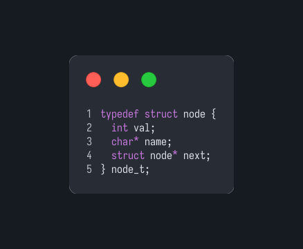
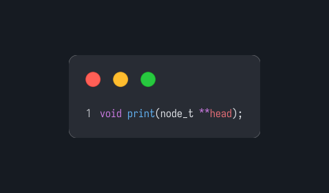
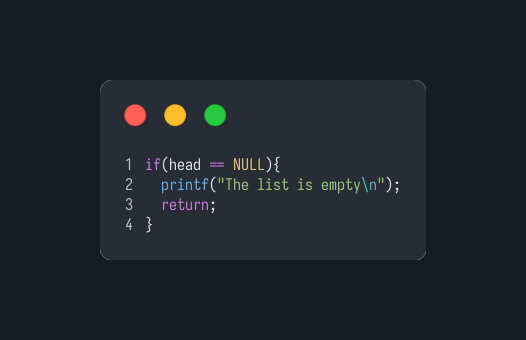
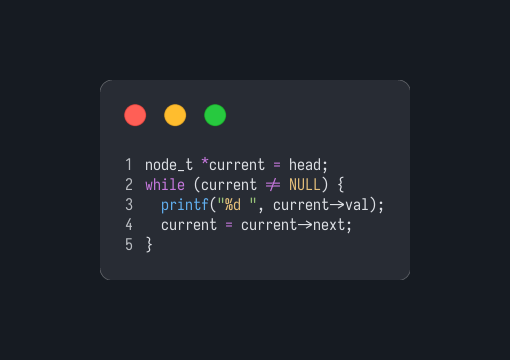
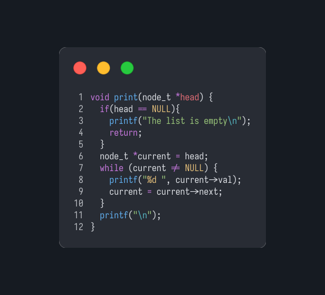
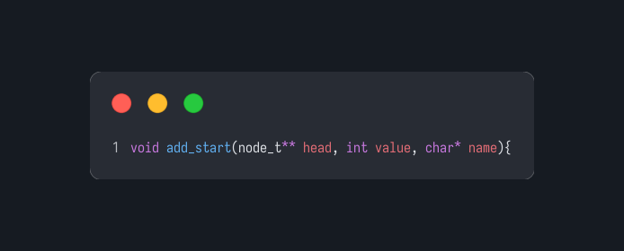
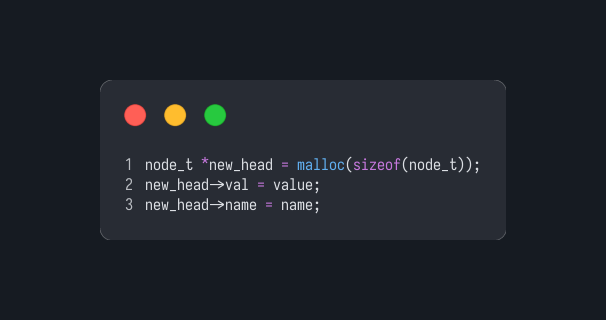
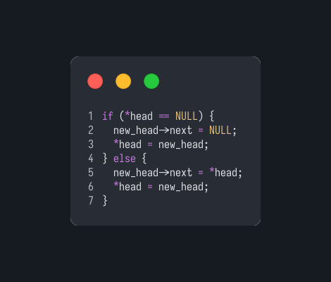
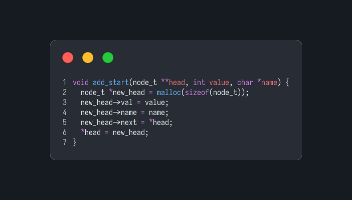

# Data Structures
This repository is for tracking my learning journey in Data Structures using the C language and the algorithms used to work with them
## Linked list
First I will start implementing linked lists. A linkd list is an abstract data structure based on nodes wich contain data and reference. There are 3 main types of linked lists (with its variants), so we are going to implement them all. And also build the algorithms that are used to work with these. 
### Single linked list
Each node in this type of list contains two values, the data that its meant to store and the reference of the next node. For this example I will be storing integers and strings.
We will also implement functions to:

- Add at the end of the list. O(n)
- Add at the start of the list. O(1)
- Delete at the end of the list. O(n)
- Delete at the start of the list. O(1)
- Adding at a given index. O(n)
- Deleting at a given index. O(n)
- Print the elements of the list using loops. O(n)
- Print the elements of the list using recursion. O(n)
- Merge sort to sort the elements of the list in ascending order based of their value. O(n $\log_2$ n)

#### Implementation of the node

> We will first implement the nodes.
>
> Each struct will have and integer called value, a string called name and a pointer to a node called next.

#### Implementation of the printing function

> Now we will implement a printing function to see the state of our list as we implement the functions
> 
> To print till the end of the list we need to get to a nul pointer ((void*)0) aka NULL
>
> At the moment we will only use the looping method

> For this function we receive a pointer of the head of our list, if it is NULL, it is the end  of our list therefore the list is emtpy so we can print a message saying so and end the function

> Now we in case its not empty we just need to get to the end of the list, so we will use a loop to advance in the list while the node we are at isnt NULL

> And while we are advancing in the list we will be printing each element 

> So at the end the function end up like this

#### Adding functions

* Adding at the start
> We will implement the three functions for adding elements

> Starting with adding at the start of the list. O(1)  
> We will need to modify the head of the list so we will receive a pointer to the pointer that points to the head node. So that we can modify the variable head, pointing to the old head, and make it point to a the new head.

> We will start by creating the new node and adding the elements that it needs 

> Now we will have the pointer variable head point to the newly created node, if the head was emtpy then the next node of or new head is NULL if not is the pointer to the old head

> But because we are going to firstly delcare our head as NULL, we can just set the next element of the new head to be the old head, because it will cover both cases  
> So the whole function ends up like so

* Adding at the end
